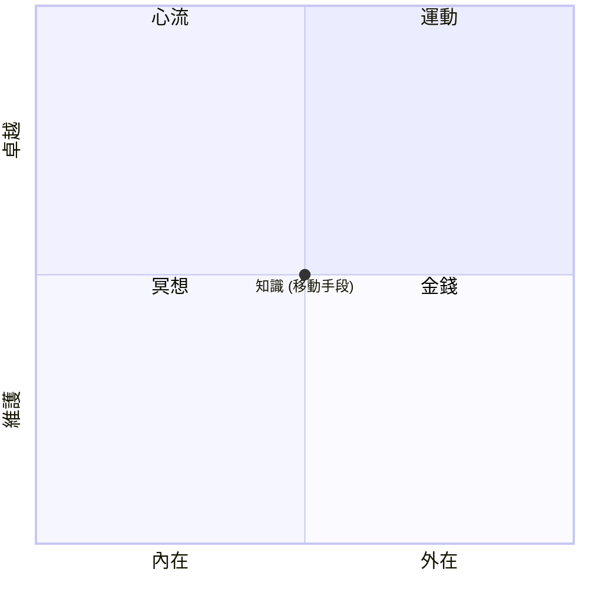

本文受納瓦爾寶典、底層邏輯、心流這三本書啟發，簡單來說就是下圖

運動：能提高個人表現，我覺得運動是為了支撐卓越的狀態。控制飲食我認為也算在這個象限裡。

心流：當難度與能力匹配時最容易出現，個人喜好也容易觸發。

冥想：寫筆記我個人認為接近冥想和一些知識的效果，冥想能使心靈恢復平靜。

金錢：研究表明，金錢對於貧窮來說能提昇很多的快樂程度，但對於本來就算有一定財富的提昇則有限。

當然這四者能互相配合利用達到更好的效果，不過我畫成四個象限是因為彼此有所侷限，比如你在身心狀況不理想時很難進入心流，忙於生計時也很難抽出時間運動，但運動太多也可能有運動傷害等，可能就不如去碰自己喜好（心流）或逛逛街（金錢）等。

知識：我覺得知識最重要的點就是他能讓你意識到你能如何修正以轉移至不同象限，否則邊際效益會讓你在同一點上的效益降低。

健康是這套系統的結果。
